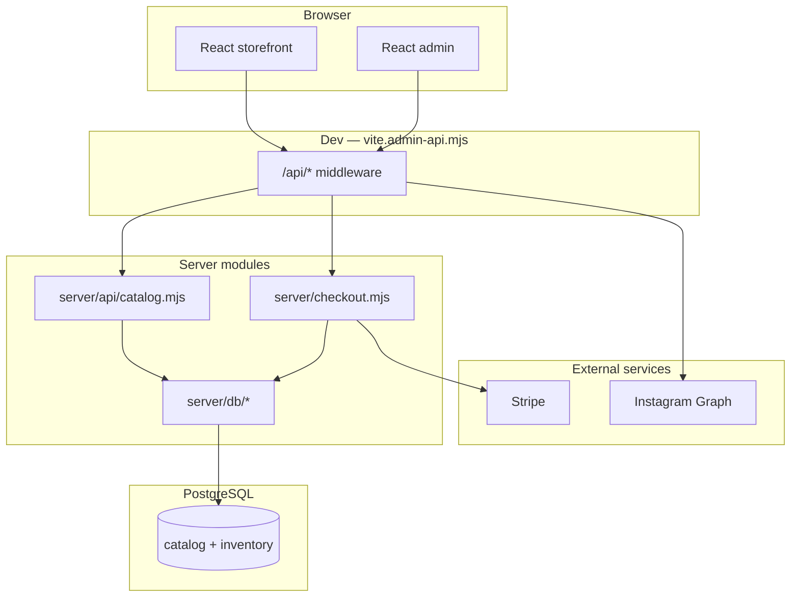

# Architecture

## Stack

| Layer | Technology |
|-------|------------|
| Front | React 19, TanStack Router/Start, Tailwind CSS v4 |
| Build | Vite 7 |
| Hosting target | Cloudflare Workers (`wrangler.jsonc`) |
| Database | **PostgreSQL** (`pg`) — Neon, Supabase, local Docker, etc. |
| Payments | Stripe Checkout + webhooks |
| Media | `/public`, `/public/shopify-import`, `/uploads` (R2 or local) |
| Instagram | Graph API → `/api/instagram` + static cache |
| Editorial CMS | Postgres `site_settings` → `/api/content/site` |

---

## Logical diagram



---

## Relevant folder structure

```
bali-luxe-experience/
├── db/
│   ├── migrations/          # Versioned SQL schema
│   └── README.md
├── docs/                    # This documentation
├── server/
│   ├── api/                 # Reusable API handlers
│   ├── db/                  # Postgres pool, catalog reads
│   ├── checkout.mjs         # Stripe (phase 1)
│   ├── catalog-store.mjs    # JSON fallback (legacy)
│   └── admin-auth.mjs
├── scripts/
│   ├── db-migrate.mjs
│   └── migrate-catalog-to-postgres.mjs
├── src/
│   ├── routes/              # TanStack Router pages
│   ├── components/
│   ├── lib/                 # cart, currency, catalog-context
│   └── data/                # Static JSON fallback
├── data/catalog.json        # S1 import source
└── vite.admin-api.mjs       # /api middleware in dev & preview
```

---

## Catalog flow (S1)

1. `CatalogProvider` (`src/lib/catalog-context.tsx`) calls `GET /api/catalog`
2. `getCatalogResponse()` (`server/api/catalog.mjs`):
   - if `DATABASE_URL` → `fetchCatalogFromDb()`
   - else → `catalog.json` (dev fallback)
3. JSON response compatible with the legacy format plus enriched fields (`variants`, `stockFrance`, `stockBali`)

---

## API in development

With `npm run dev` and `npm run preview`, all `/api/*` routes go through **`vite.admin-api.mjs`**.

In **Cloudflare production**, the same handlers must be exposed on the Worker (migration in progress — see [06-deployment.md](./06-deployment.md)).

---

## Admin authentication

- Signed session cookie (`ADMIN_SECRET`)
- Password `ADMIN_PASSWORD`
- `/api/admin/*` routes protected by `requireAdmin`

---

## Editorial CMS flow (S8)

1. `ContentProvider` (`src/lib/content-context.tsx`) calls `GET /api/content/site`
2. `getSiteContent()` (`server/db/cms-site.mjs`) merges Postgres settings with defaults from `server/content-defaults.mjs`
3. Admin edits via `PATCH /api/admin/content/site` (keys: `announcement`, `homepage`, `about`, `findUs`)
4. CMS media uploads → `POST /api/admin/upload?slug=cms/…` → R2 or `public/uploads/`

**Full guide:** [08-content-cms-and-design.md](./08-content-cms-and-design.md)

---

## Configuration files

| File | Role |
|------|------|
| `.env.local` | Local secrets (not committed) |
| `.env.example` | Variable template |
| `wrangler.jsonc` | Cloudflare deploy |
