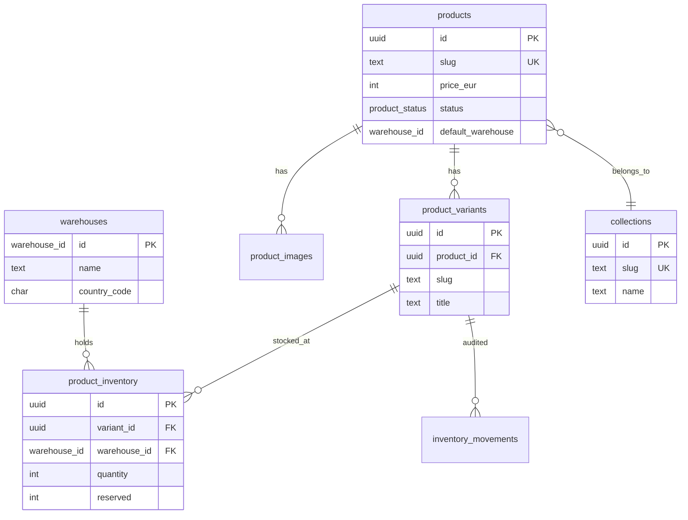

# PostgreSQL database

**Initial migration:** `db/migrations/001_initial_schema.sql`  
**Migration tracking:** `schema_migrations` table (created by `scripts/db-migrate.mjs`)

---

## Relational schema (overview)



---

## ENUM types

| Type | Values |
|------|--------|
| `warehouse_id` | `france`, `bali` |
| `product_status` | `draft`, `published` |
| `product_origin` | `Bali`, `France` |

---

## Tables created (S1)

| Table | Role |
|-------|------|
| `schema_migrations` | Applied SQL files (migrate script) |
| `warehouses` | France & Bali warehouses (2 seed rows) |
| `collections` | Shop collections |
| `products` | Products (pricing, status, origin, default warehouse) |
| `product_images` | Image gallery per product |
| `product_variants` | Variants (size, color, Shopify SKU, etc.) |
| `product_inventory` | **Stock per variant × warehouse** |
| `inventory_movements` | Audit log (writes from S2+) |

---

## Key column details

### `products`

| Column | Description |
|--------|-------------|
| `slug` | URL `/product/{slug}` |
| `price_eur`, `price_usd`, `price_idr` | Catalog prices |
| `compare_at_eur` | Sale price when lower than `price_eur` |
| `origin` | `Bali` or `France` (business / marketing) |
| `default_warehouse` | Default fulfillment warehouse (`france` \| `bali`) |
| `shopify_product_id` | Shopify migration reference |

### `product_variants`

| Column | Description |
|--------|-------------|
| `slug` | Unique per product (`{product-slug}-default` or `{product-slug}-{option}`) |
| `option1/2/3` | Shopify options |
| `price_eur` | Optional override (else product price) |
| `is_default` | Default variant shown in UI |
| `shopify_variant_id` | Original Shopify ID |

### `product_inventory`

| Column | Description |
|--------|-------------|
| `quantity` | Available stock |
| `reserved` | Reserved (in-checkout — used S2+) |
| **Constraint** | `UNIQUE (variant_id, warehouse_id)` |

---

## Example: product with variants

Real product after import: **`90s-fisherman-black`**

### SQL — product + variants + stock

```sql
-- Product
SELECT slug, name, price_eur, origin, default_warehouse, status
FROM products
WHERE slug = '90s-fisherman-black';

-- Product variants
SELECT v.slug, v.title, v.sku, v.is_default, v.shopify_variant_id
FROM product_variants v
JOIN products p ON p.id = v.product_id
WHERE p.slug = '90s-fisherman-black'
ORDER BY v.position;

-- France / Bali stock per variant
SELECT
  p.slug AS product,
  v.slug AS variant,
  v.title,
  i.warehouse_id,
  i.quantity,
  i.reserved,
  i.quantity - i.reserved AS available
FROM product_inventory i
JOIN product_variants v ON v.id = i.variant_id
JOIN products p ON p.id = v.product_id
WHERE p.slug = '90s-fisherman-black'
ORDER BY v.position, i.warehouse_id;
```

### Example stock result (S1 logic)

After `npm run db:seed-catalog`, for a product with `origin = Bali`:

| variant | warehouse_id | quantity | reserved | available |
|---------|--------------|----------|----------|-----------|
| `90s-fisherman-black-default` | `bali` | 1 | 0 | 1 |
| `90s-fisherman-black-default` | `france` | 0 | 0 | 0 |

**S1 import rule:** all initial stock goes into the warehouse matching `products.origin`; the other warehouse is set to 0.

### API JSON (`GET /api/catalog`)

Expected excerpt for the same product:

```json
{
  "slug": "90s-fisherman-black",
  "name": "90's Fisherman | Black",
  "origin": "Bali",
  "defaultWarehouse": "bali",
  "stock": 1,
  "stockFrance": 0,
  "stockBali": 1,
  "variants": [
    {
      "id": "uuid-variant",
      "slug": "90s-fisherman-black-default",
      "title": "Default",
      "isDefault": true,
      "inventory": { "france": 0, "bali": 1 },
      "available": true
    }
  ]
}
```

Products with **multiple Shopify variants** (e.g. sizes): one `product_variants` row per Shopify variant, each with two `product_inventory` rows (`france` + `bali`).

---

## Project commands

```bash
# Create schema + seed warehouses
npm run db:migrate

# Import catalog (JSON + live Shopify variants)
npm run db:seed-catalog

# All-in-one
npm run db:setup

# Full re-import (clears catalog tables)
npm run db:seed-catalog -- --reset
```

---

## Useful sanity queries

```sql
-- Counts
SELECT
  (SELECT COUNT(*) FROM products) AS products,
  (SELECT COUNT(*) FROM product_variants) AS variants,
  (SELECT COUNT(*) FROM product_inventory) AS inventory_rows;

-- Total stock per warehouse
SELECT warehouse_id, SUM(quantity) AS total_qty
FROM product_inventory
GROUP BY warehouse_id;

-- Products without variants (anomaly)
SELECT p.slug
FROM products p
LEFT JOIN product_variants v ON v.product_id = p.id
WHERE v.id IS NULL;
```

See [sprint-s1-validation.md](./sprint-s1-validation.md) for the full checklist.
