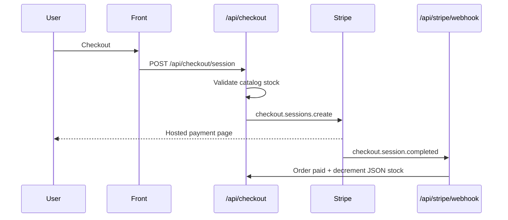

# Stripe

**Status:** Phase 1 implemented (checkout + webhook). Orders still in `data/orders.json` — Postgres migration planned for S3.

---

## Flow



> **S2 note:** stock decrement will move to `product_inventory` in Postgres.

---

## Files

| File | Role |
|------|------|
| `server/checkout.mjs` | Stripe session, webhook, fulfillment |
| `server/stripe-client.mjs` | SDK client |
| `server/orders-store.mjs` | JSON order storage (temporary) |
| `src/lib/checkout.ts` | Front client |
| `src/components/site/CheckoutButton.tsx` | Cart button |

---

## API routes

| Method | Route | Auth |
|--------|-------|------|
| `POST` | `/api/checkout/session` | Public |
| `GET` | `/api/checkout/session?session_id=` | Public |
| `POST` | `/api/stripe/webhook` | Stripe signature |

---

## Environment variables

```env
STRIPE_SECRET_KEY=sk_test_... or sk_live_...
STRIPE_WEBHOOK_SECRET=whsec_...
SITE_URL=https://your-domain.com
```

Never expose these keys in `VITE_*`.

---

## Local webhook

```bash
npm run stripe:webhook
# forwards to http://localhost:8080/api/stripe/webhook
```

Copy the displayed `whsec_...` into `.env.local`.

---

## Front pages

| Route | Role |
|-------|------|
| `/checkout/success?session_id=` | Confirmation |
| `/checkout/cancel` | Payment cancelled |

---

## Shipping (current MVP)

Flat rate in `server/pricing.mjs`:

| Currency | Amount |
|----------|--------|
| EUR | €8 |
| USD | $10 |
| IDR | 120,000 Rp |

To be replaced with country / warehouse rules (roadmap).
